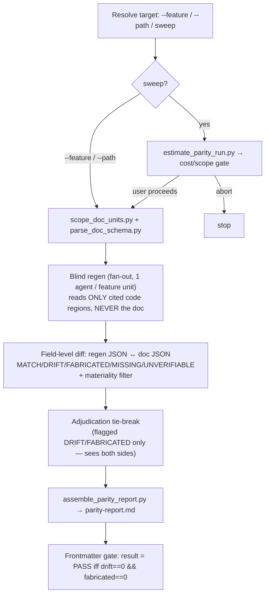

# Audit Doc Parity

A spec that reads beautifully and lies is worse than no spec. Wording review — even a careful one —
trusts the citation and reads the claim *next to* it; it confirms structure and depth, never **truth**.
This skill does the one thing that review cannot: it re-describes the code **without ever seeing the
doc**, then compares the two descriptions field by field. Drift, fabrication, and undocumented behavior
fall out of the diff. That is parity, and **parity ≠ wording**.

Born to close the blind spot in rebuild-spec's W7a review (checks citation *existence* + wording, never
claim *truth*; suffers anchoring bias). Standalone and on-demand — reusable on any citation-anchored,
rebuild-spec-shaped docs (rebuild-spec output, migrate-aidd output, hand-written specs that cite code).

## What it is NOT

- **Not a wording/quality reviewer** — that is `review-code` Stage 1 and rebuild-spec W7a. This verifies truth.
- **Not a mutator** — report-only. It emits `parity-report.md`; a human decides the fixes. (Emitter, not gated consumer — same stance as `review-code`.)
- **Not a depth grader** — it never judges "is this explained well enough" (Iron Law #6). It flags only what code provably contradicts or omits.

## v1 scope (read before running)

v1 is **citation-anchored / rebuild-spec-shaped**: it requires docs that carry `**Source:** path:N-M`
citations and structured templates (so code-region scoping and field-diff are both reliable).
A doc claim with no citation → `UNVERIFIABLE`, never a guess. **Generic docs-root** (arbitrary prose
docs without citations) and **baseline/suppression** ("what drifted since last audit") are **v2** —
they need a first-class doc→code locator. See `references/` and the plan's "Out of scope".

## Processing Levels

Accepts `--level low|medium|high|max` (default: `medium`). See `_shared/processing-levels.md` for global semantics.

| Level | Blind-regen | Adjudication tie-break | Fan-out |
|-------|-------------|------------------------|---------|
| `low` | Targeted units only (`--feature`/`--path`); skip default sweep gate prompt | On critical (DRIFT/FABRICATED) only | Serial |
| `medium` *(default)* | All in-scope units | On all flagged DRIFT/FABRICATED | Bounded batch |
| `high` | All in-scope units + output-contract sub-field diff forced | On all flagged + spot-check a MATCH sample | Bounded batch |
| `max` | All units, larger context per unit | Multi-pass adjudication (2 independent re-reads) | Max parallel |

## Critical Rules (Iron Laws)

Full text + failure-mode mapping in [`references/iron-laws.md`](references/iron-laws.md). Inlined here because they are load-bearing:

**🚫 NEVER (violation → skill collapses back into W7a):**
1. NEVER let the regen agent see the doc before re-describing the code. *(This IS the architecture — the anchoring defeat.)*
2. NEVER assert a regenerated behavior without a code line citation. *(Anti-hallucination pillar #1.)*
3. NEVER finalize a DRIFT/FABRICATED verdict without the adjudication tie-break. *(Anti-false-finding.)*
4. NEVER mutate doc or code — report-only.
5. NEVER emit MISSING for non-documentation-worthy code (materiality filter).
6. NEVER grade subjective spec depth/sufficiency — flag under-detail ONLY when provably extractable from code.

**⚠️ DON'T:** read whole files to regen (scope to citation + enclosing block) · run the default sweep without the estimate gate · field-diff free prose · guess a code region when the citation is absent (→ UNVERIFIABLE) · assert on an ambiguous legacy signal (→ UNVERIFIABLE).

**✅ DO:** reuse rebuild-spec templates as the regen schema · tag every finding with the `confidence` taxonomy · emit machine-readable frontmatter · severity = blast radius (auth/data/security/money = critical).

## Process Flow



**The diagram is the source of truth for the flow.** Full step detail: [`references/pipeline.md`](references/pipeline.md).

## Usage

```
/tkm:audit-doc-parity                      # default sweep — all in-scope docs (estimate gate first)
/tkm:audit-doc-parity --feature F012       # one feature unit, no gate
/tkm:audit-doc-parity --path docs/features/F012_OrderExport/technical-spec.md
/tkm:audit-doc-parity sweep --level high   # full sweep, output-contract sub-field diff forced
```

- `--feature F###` / `--path <doc>` run **targeted** and bypass the estimate gate.
- Default sweep runs `estimate_parity_run.py` first and prompts before fan-out (cost guard).
- Python via `.claude/skills/.venv/bin/python3 claude/skills/audit-doc-parity/scripts/<script>.py`.

## Read-only / emitter-not-gate

This skill **emits** `parity-report.md` (+ machine-readable frontmatter); it does not act on it. Like
`review-code`, gating against its own output would be circular — the *consumer* (rebuild-spec W9, CI, a
human) reads `result` + `drift`/`fabricated` and decides. audit-doc-parity never mutates doc or code.

## References

- [`references/iron-laws.md`](references/iron-laws.md) — the 6 NEVER + DON'T + DO, with failure-mode mapping
- [`references/regen-schema-contract.md`](references/regen-schema-contract.md) — per-artifact comparable field set (regen emits + parser extracts)
- [`references/verdict-taxonomy.md`](references/verdict-taxonomy.md) — 5 verdicts, severity rubric, `parity_score`, `result`
- [`references/materiality-filter.md`](references/materiality-filter.md) — what is documentation-worthy (incl. output contracts)
- [`references/legacy-considerations.md`](references/legacy-considerations.md) — legacy hazards (exclusion, non-source behavior, encoding, dead code)
- [`references/pipeline.md`](references/pipeline.md) — orchestration: estimate-gate → scope → blind-regen → diff → adjudicate → assemble
- [`references/blind-regen-prompt.md`](references/blind-regen-prompt.md) — the subagent contract (read ONLY code, cite every behavior)
- [`references/adjudication-protocol.md`](references/adjudication-protocol.md) — tie-break on flagged DRIFT/FABRICATED only
- Reuse anchors: `rebuild-spec/templates/*` (regen schema), `confidence/SKILL.md` (taxonomy), `rebuild-spec/templates/review-report-template.md` (report shape)
