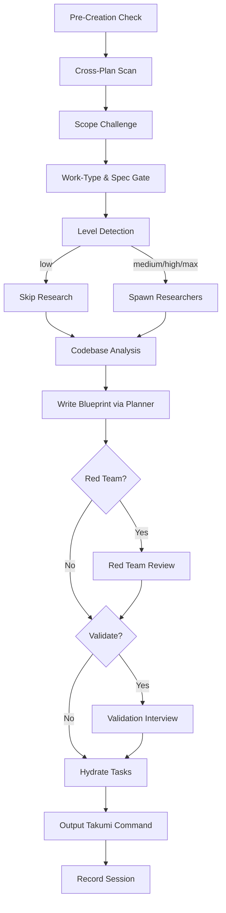

# Blueprint

No one frames a house from memory. The drawing comes first, and the drawing is where the cost of a bad joint gets paid — on paper, not in the wood.

This skill turns a request into a technical blueprint: research the problem, read the existing codebase, settle on an approach, and write it all down in enough detail that someone else could build from it. Whatever lands here is exactly what `/tkm:takumi` will pick up and execute, so the care you spend now compounds downstream.

**IMPORTANT:** Open by surveying the unfinished plans already living under `./plans/`. Read each `plan.md`. If any of them overlap with what you're about to draft, fold the new reality into them too. When the picture is murky or a decision isn't yours to make, stop and ask via the `AskUserQuestion` tool.

### Cross-Plan Dependency Detection

A blueprint rarely stands alone. While you scan the existing plans before creating a new one, trace where one plan's work gates another's:

1. **Scan** — Read the `plan.md` frontmatter of every plan still open (status not `completed` or `cancelled`)
2. **Compare scope** — Look for shared files, common dependencies, or the same feature territory
3. **Classify relationship:**
   - New plan needs output of existing plan → new plan `blockedBy: [existing-plan-dir]`
   - New plan changes something existing plan depends on → existing plan `blockedBy: [new-plan-dir]`, new plan `blocks: [existing-plan-dir]`
   - Mutual dependency → both plans reference each other in `blockedBy`/`blocks`
4. **Bidirectional update** — Once a link is found, write it into BOTH `plan.md` frontmatters, not just one
5. **Ambiguous?** → Use `AskUserQuestion` with header "Plan Dependency", show the overlap you found, and let the user confirm the relationship type (blocks/blockedBy/none)

**Frontmatter fields** (relative plan dir paths):
```yaml
blockedBy: [260301-1200-auth-system]     # This plan waits on these plans
blocks: [260228-0900-user-dashboard]     # This plan blocks these plans
```

**Status interaction:** If a plan carries `blockedBy` entries and any one of those blockers hasn't reached `completed`, its overview should flag the plan as `blocked`. The moment every blocker finishes, the next scan clears that flag on its own — no manual bookkeeping.

## Default (No Arguments)

Given a task description, run the blueprint workflow straight through. Called bare — no arguments, or intent you can't read — fall back to `AskUserQuestion` and lay out the operations on offer:

| Operation | Description |
|-----------|-------------|
| `(default)` | Draft an implementation blueprint for a task |
| `archive` | Record the session & file the plans away |
| `red-team` | Tear the blueprint apart adversarially |
| `validate` | Walk the blueprint through a critical-questions interview |

Surface these through `AskUserQuestion` under the header "Blueprint Operation", asking "What would you like to do?".

## Processing Level

Accepts `--level low|medium|high|max` (default: `medium`).
See `_shared/processing-levels.md` for the global semantics. The level dials **how hard the blueprint works** — research depth and which gates run. It is the only effort knob; strategy is separate (see below).

| Level | Research | Scout | Red Team | Validation | Takumi handoff |
|-------|----------|-------|----------|------------|----------------|
| `low` | Skip | Skip | Skip | Skip | `--auto` (lean plan → lean execution) |
| `medium` *(default)* | 1 light pass | Skip | Skip | Skip | (none) |
| `high` | 2 researchers | Optional | Yes | Optional | (none) |
| `max` | 2-3 researchers + per-phase scout | Yes | Yes | Yes | (none) |

`--auto` (or no flag) auto-detects the level from the task — see `references/workflow-modes.md`.

### Orthogonal flags (strategy, not effort — compose with any level)

| Flag | Effect |
|------|--------|
| `--parallel` | Fan research/work across concurrent agents; hands `--parallel` to takumi. Raises the gates like `high`. |
| `--two` | Draft two competing approaches and compare before committing. Gates run after selection. |
| `--tdd` | Add tests-first structure to each phase (regression-safe refactors). |
| `--no-tasks` | Skip task hydration. |
| `--html` | Also render a self-contained editorial `plan.html` companion next to `plan.md` (per `../_shared/references/editorial-report-html.md`). `plan.md` stays the primary artifact and the cook handoff contract — do not make the HTML primary. |
| `--grill` | Run the validation/clarification interview as a relentless one-question-at-a-time loop (loads `../../rules/grill-loop-protocol.md`) instead of batched 3-8 questions. Also usable as `validate --grill`. The interview stays main-thread even under `--parallel`. |

### Deprecated aliases

`--fast` → `--level low` · `--hard` → `--level high` · `--deep` → `--level max`.
These still work and behave identically, but print a one-line deprecation notice nudging toward `--level`. Prefer `--level`. (`--parallel`/`--two` were never effort levels — they remain orthogonal flags above.)

Load: `references/workflow-modes.md` for the auto-detection logic, the per-level workflow, alias resolution, and the context reminders.

## When to Use

- Standing up a new feature
- Sketching the shape of a system
- Weighing one technical approach against another
- Laying out a roadmap toward implementation
- Cutting a tangle of requirements into something buildable

## Core Responsibilities & Rules

Hold to **YAGNI**, **KISS**, and **DRY** throughout.
**Say it straight, say it short, and don't soften the hard parts.**

### 0. Scope Challenge
Load: `references/scope-challenge.md`
**Skip if:** `--level low`, or the task is trivial (one-file fix, under 20 words)

### 1. Research & Analysis
Load: `references/research-phase.md`
**Skip if:** `--level low`, or researcher reports are already in hand

### 2. Codebase Understanding
Load: `references/codebase-understanding.md`
**Skip if:** Scout reports are already in hand

### 3. Solution Design
Load: `references/solution-design.md`

### 4. Blueprint Creation & Organization
Load: `references/plan-organization.md`

### 5. Task Breakdown & Output Standards
Load: `references/output-standards.md`

## Process Flow (Authoritative)



**Treat the diagram as the source of truth for the workflow.** The prose below just fills in what each node means.

## Workflow Process

1. **Pre-Creation Check** → Read Plan Context to learn whether a plan is active, suggested, or none
1b. **Cross-Plan Scan** → Sweep the open plans, find any `blockedBy`/`blocks` links, and write them into both sides
1c. **Scope Challenge** → Work the Step 0 scope questions and settle the level (see `references/scope-challenge.md`)
    **Skip if:** `--level low` or a trivial task
1d. **Work-Type & Spec Gate** (BLOCKING — runs before any `F###` reservation claim):
    Classify work-type (`feature` / `deliverable` / `ambiguous`), run the SDD-mode + promote-sentinel
    pre-checks, and route the spec decision (existing / revise / absent → author/waive/switch).
    **Load `references/work-type-spec-gate.md`** for the full procedure — do NOT run this gate from the
    summary alone. Key outcomes it produces: `work_type:`, and one of `spec:` / `spec_draft:` /
    `spec_waived:` in `plan.md` frontmatter (see "Spec Provenance Frontmatter" below).
2. **Level Detection** → Let auto-detection decide, or honor the explicit `--level` (see `workflow-modes.md`)
3. **Research Phase** → Send out researchers (skipped at `--level low`)
4. **Codebase Analysis** → Read the docs, scout the code when the docs fall short
5. **Blueprint Documentation** → Hand the planner subagent the job of writing the full plan
   - If a draft was authored (choice a), pass its path to the planner. The planner MUST: (a) reference
     FR/SC/US IDs from `{draft}/technical-spec.md` in each phase — do NOT re-derive requirements
     already captured; (b) write `spec_draft: plans/<plan_dir>/spec/<slug>/` into `plan.md` YAML
     frontmatter. If instead a PROMOTED spec already exists in `docs/features/` and is not being revised, <!-- layout-exempt: promoted spec path uses docs/ root (single-lang); mode-aware pointer in frontmatter-fields.md -->
     write `spec: docs/features/F###_Slug/`. Never both; omit both for specless tasks. `spec:` is
     otherwise written only by takumi's promote step (Stage 0).
   - **`--level low`:** Even when Stage 1.5 was minimal (a partial draft), the planner MUST still
     write `spec_draft: plans/<plan_dir>/spec/<slug>/` into `plan.md` so promote repoints it to `spec:`
     at implement-start. The partial spec keeps `status: draft` — only a full
     `/tkm:rebuild-spec --features F###` run completes the 4-file set after promote.
6. **Red Team Review** → Run `/tkm:create-plan red-team {plan-path}` (at `--level high|max`, or with `--parallel`/`--two`)
7. **Post-Blueprint Validation** → Run `/tkm:create-plan validate {plan-path}` (at `--level max`; optional at `high`)
8. **Hydrate Tasks** → Spin Claude Tasks out of the phases (on by default, `--no-tasks` opts out)
9. **Context Reminder** → Emit the takumi command with its absolute path (MANDATORY)
10. **Record Session** → Close out by running `/tkm:write-journal` for a tight session record

## Output Requirements

**IMPORTANT:** Invoke "/tkm:organize-files" skill to organize the outputs.

- Never write implementation code here — the deliverable is the blueprint, nothing more
- Hand back the blueprint's file path plus a summary
- If `--html` was passed, also write `plan.html` next to `plan.md` (companion, generated after any validate/red-team gate) using `../_shared/references/editorial-report-html.md`; `plan.md` remains primary
- Make each blueprint stand on its own — carry the context it needs inside it
- Drop in snippets or pseudocode wherever they clear up intent
- Fully respect the `./claude/rules/development-rules.md` file

## Task Management

Blueprint files outlive the session; tasks die with it. Hydration is the bridge between the two.

**Default:** Tasks hydrate automatically once the blueprint files exist. `--no-tasks` turns that off.
**3-Task Rule:** Fewer than 3 phases → don't bother creating tasks.
**Fallback:** The task tools (`TaskCreate`/`TaskUpdate`/`TaskGet`/`TaskList`) only run in the CLI — the VSCode extension doesn't have them. When they throw, track with `TodoWrite` instead. The blueprint files stay authoritative; hydration is a convenience, not a prerequisite.

Load: `references/task-management.md` for the hydration pattern, TaskCreate patterns, and the takumi handoff protocol.

### Hydration Workflow
1. Lay down plan.md + the phase files — that's the layer that persists
2. TaskCreate one task per phase, chained with `addBlockedBy` (skip when the Task tools are missing)
3. TaskCreate extra tasks for the critical or high-risk steps inside phases (skip when the Task tools are missing)
4. Metadata: phase, priority, effort, planDir, phaseFile
5. Takumi grabs the tasks via TaskList in the same session, or rebuilds them from scratch in a new one

## Active Plan State

Read the `## Plan Context` the hooks inject:
- **"Plan: {path}"** → A plan is active. Ask "Continue? [Y/n]"
- **"Suggested: {path}"** → Just a branch hint. Ask whether to activate it or start fresh.
- **"Plan: none"** → Start a new one off the `Plan dir:` in `## Naming`

Once the blueprint exists: `node .claude/scripts/set-active-plan.cjs {plan-dir}`
Reports: active plans get their own plan-specific path; suggested ones fall back to the default path.

### Spec Provenance Frontmatter

The Work-Type & Spec Gate (step 1d) and the planner record at most one spec-provenance field into
`plan.md` — `spec_draft:`, `spec:`, or `spec_waived:` — plus the orthogonal `work_type:`. They are
mutually exclusive (never emit two). Producer/consumer rules and YAML shapes live in
**`references/frontmatter-fields.md`** — read it before writing any of these fields.

### Important
**DO NOT** create plans or reports in USER directory.
**MUST** create plans or reports in **THE CURRENT WORKING PROJECT DIRECTORY**.

## Subcommands

| Subcommand | Reference | Purpose |
|------------|-----------|---------|
| `/tkm:create-plan archive` | `references/archive-workflow.md` | File plans away and write the session records |
| `/tkm:create-plan red-team` | `references/red-team-workflow.md` | Hand the blueprint to hostile reviewers to break |
| `/tkm:create-plan validate` | `references/validate-workflow.md` | Pressure-test the blueprint through a critical-questions interview |
| `/tkm:create-plan validate --grill` | `references/validate-workflow.md` | Same interview, run as a relentless one-question-at-a-time grill loop (no 3-8 batching) |

## Quality Standards

- Specific and complete — write with the long maintenance tail in mind
- When you're unsure, dig deeper before committing
- Name the security and performance stakes up front
- Detailed enough that a junior dev could follow it
- Square every choice against the patterns already in the codebase

**Remember:** What you build is only as sound as the blueprint behind it. A thin plan yields thin work. Draw it with care.
