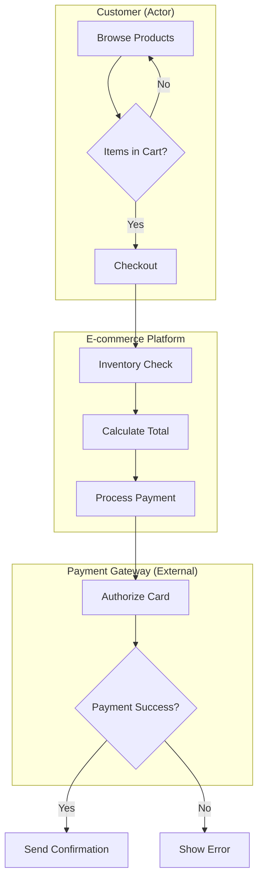
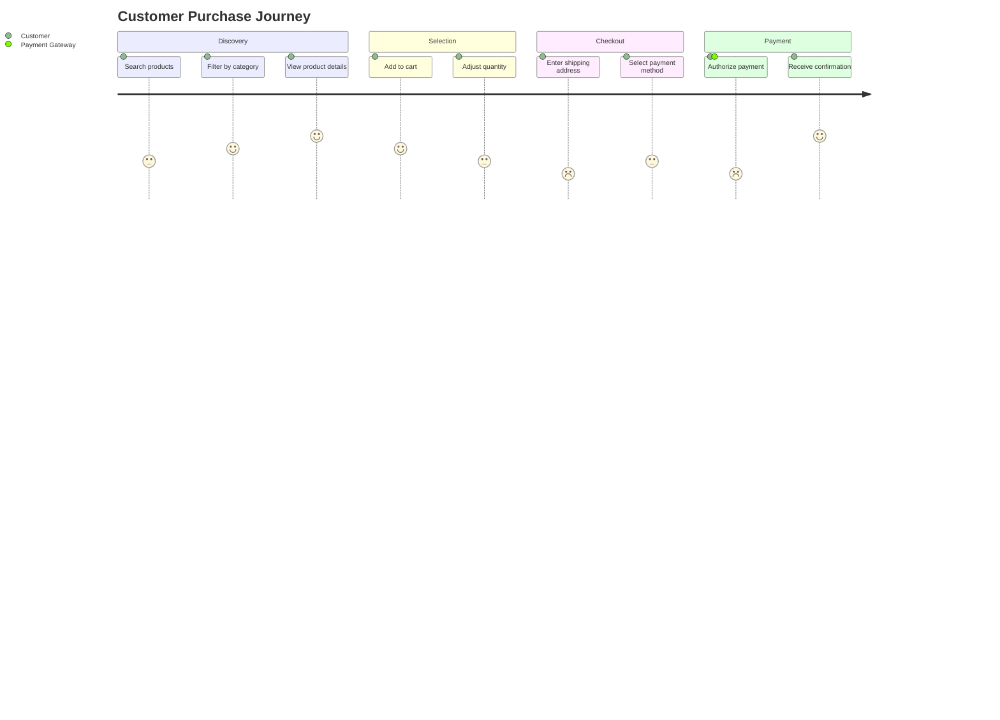
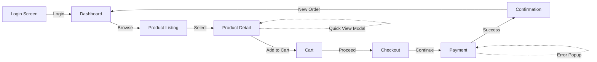

# RFP Analysis Templates

Reference templates for analyzing RFP documents and generating discovery artifacts.

## Business Flow Template

### Mermaid Flowchart Structure

### Rules
- One subgraph per actor or external system
- Decision nodes use curly braces `{}`
- Max 15 nodes per diagram (split complex flows)
- Label external system boundaries clearly
- Use meaningful node IDs (C1, S1, P1 for Customer/System/Payment)

---

## User Journey Template

### Per-Actor Journey Table

| Phase | Action | Screen | Input/Output | Pain Point | Note |
|-------|--------|--------|--------------|------------|------|
| Discovery | Search for products | Product Listing | Search keywords → Filtered results | Too many irrelevant results | Consider AI-powered search |
| Selection | Add items to cart | Product Detail | Click "Add to Cart" → Cart updated | No stock indicator | Show real-time availability |
| Checkout | Enter shipping info | Checkout Form | Address, phone → Validation feedback | Form too long | Implement autofill |
| Payment | Confirm payment | Payment Gateway | Card details → Transaction status | Redirect delay | Use embedded iframe |
| Confirmation | View order summary | Order Confirmation | Order ID → Receipt email | Email delay | Send SMS backup |

### Mermaid Journey Diagram

### Satisfaction Scores
- 1 = Very dissatisfied
- 2 = Dissatisfied
- 3 = Neutral
- 4 = Satisfied
- 5 = Very satisfied

---

## Screen Flow Template

### Mermaid Screen Flow

### Screen List Table

| ID | Screen Name | Device | Level | Actors | Key Actions |
|----|-------------|--------|-------|--------|-------------|
| S1 | Login | Web, Mobile | L1 | Customer | Email/password login, social OAuth, forgot password |
| S2 | Dashboard | Web, Mobile | L1 | Customer | View order history, wishlist, profile settings |
| S3 | Product Listing | Web, Mobile | L2 | Customer | Search, filter, sort, pagination |
| S4 | Product Detail | Web, Mobile | L2 | Customer | View images, description, reviews, add to cart |
| S5 | Cart | Web, Mobile | L2 | Customer | Update quantity, remove items, apply coupon, checkout |
| S6 | Checkout | Web, Mobile | L3 | Customer | Enter/select address, choose shipping method |
| S7 | Payment | Web | L3 | Customer, Payment Gateway | Enter card details, authorize payment |
| S8 | Confirmation | Web, Mobile | L2 | Customer | View order summary, download receipt, track order |

### Device Legend
- Web: Desktop browser
- Mobile: iOS/Android app or responsive web

### Level Legend
- L1: Core screens (always needed)
- L2: Standard screens (common features)
- L3: Advanced screens (complex workflows)

### Flow Annotations
- Solid arrows: Primary navigation
- Dotted arrows: Modals, popups, overlays
- Labels on arrows: Action that triggers navigation
