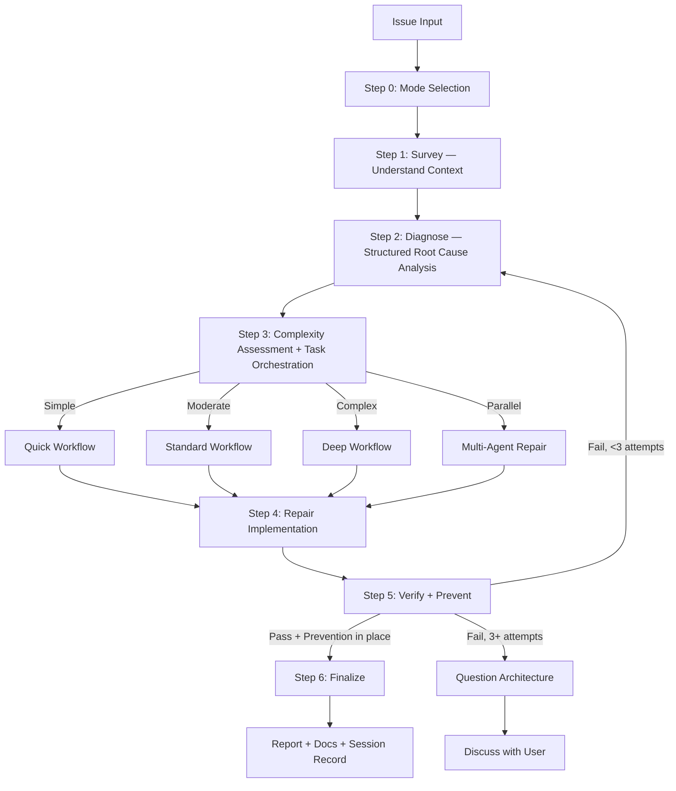

# Repairing the Defect

Paper over a fault at the surface and it crawls back out the same seam. The bench rule here is simple: reach for understanding before you reach for the keyboard. Trace the fault to where it actually lives, then — and only then — touch the code.

## Arguments

- `--auto` — Autonomous mode (**default**)
- `--review` — Human-in-the-loop review mode
- `--quick` — Quick mode for trivial issues
- `--parallel` — Route to parallel `implementer` agents per issue

## The Repair Law

Nothing gets proposed as a fix until the Survey (Step 1) and the Diagnosis (Step 2) are both behind you. Patching a symptom is a failure wearing a success costume — go find the origin with structured analysis. A hunch is not a diagnosis.

Three failed repair attempts is a signal, not a setback: **stop**. The design itself may be wrong. Raise it with the user before you swing again.

*Exception:* `--quick` mode permits a compressed survey→diagnose→fix loop for throwaway issues (lint, type errors).
*User override:* When the user names a specific fix, do what they asked.

## The Craftsman's Discipline

*"A symptom you can see is not a cause you understand."*
— Walk the affected area before any hypothesis takes shape.

*"The temporary fix is a myth."*
— Do it right now, or do it again later when the conditions are worse.

*"Poking at X to watch what happens is not investigation."*
— Blind edits burn time and seed fresh faults. Investigate with a method.

*"'Probably' carries no weight."*
— A 'probably' is a guess in formal wear. Hold the hypothesis up against the evidence first.

*"Three strikes means the bat is wrong."*
— After the third failure, halt and reconsider the design. Swinging harder only deepens the hole.

*"A fire is no licence to skip the method."*
— Structured diagnosis beats guess-and-check on the clock. The method *is* the fast path.

*"Recalling the codebase is not the same as reading it."*
— Survey to confirm what you assume. Memory rots; the source on disk does not lie.

*"A green test bar does not mean the defect is dead."*
— Skip prevention and the whole defect family wanders back in. Leave guards behind.

## Process Flow (Authoritative)



**This diagram is the authoritative workflow.** Where the prose and the flow disagree, the flow wins.

## Workflow

### Step 0: Mode Selection

**First action:** When the request carries no "auto" keyword, use `AskUserQuestion` to settle the workflow mode:

| Option | Recommend When | Behavior |
|--------|----------------|----------|
| **Autonomous** (default) | Simple/moderate issues | Auto-approve if score ≥ 9.5 & 0 critical |
| **Human-in-the-loop** | Critical/production code | Pause for approval at each step |
| **Quick** | Type errors, lint, trivial bugs | Fast survey → diagnose → repair cycle |

See `references/mode-selection.md` for AskUserQuestion format.

### Step 1: Survey (MANDATORY — never skip)

**Purpose:** Learn the lay of the affected code BEFORE any hypothesis forms.

**Required actions:**
1. Activate `tkm:scan-codebase` skill OR launch 2–3 parallel `Explore` subagents
2. Surface: affected files, dependencies, related tests, recent changes (`git log`)
3. Read `./docs` for project context when the codebase is unfamiliar

**Quick mode:** Light survey — pin the affected file(s) and their immediate dependencies, nothing more.
**Standard/Deep mode:** Full survey — chart module boundaries, test coverage, and call chains.

**Output:** `⚒ Step 1: Surveyed — [N] files mapped, [M] dependencies, [K] tests found`

### Step 2: Diagnose (MANDATORY — never skip)

**Purpose:** Root cause analysis with a method. No guessing. Evidence carries every claim.

**Required actions:**
1. **Capture pre-repair state:** Copy down the exact error messages, failing test output, stack traces, log snippets verbatim. This is the baseline Step 5 will measure against.
2. Activate `tkm:debug-code` skill (systematic-debugging + root-cause-tracing techniques)
3. Activate `tkm:think-sequential` skill — reason hypotheses into shape rather than guessing them
4. Spawn parallel `Explore` subagents to weigh each hypothesis against the evidence in the code
5. If 2+ hypotheses fall → auto-activate `tkm:solve-problem` skill for fresh angles
6. Write the diagnosis report: confirmed root cause, evidence chain, affected scope

See `references/diagnosis-protocol.md` for full methodology.

**Output:** `⚒ Step 2: Diagnosed — Root cause: [summary], Evidence: [brief], Scope: [N files]`

### Step 3: Complexity Assessment & Task Orchestration

Classify before you route. See `references/complexity-assessment.md`.

| Level | Indicators | Workflow |
|-------|------------|----------|
| **Simple** | Single file, clear error, type/lint | `references/workflow-quick.md` |
| **Moderate** | Multi-file, root cause unclear | `references/workflow-standard.md` |
| **Complex** | System-wide, architecture impact | `references/workflow-deep.md` |
| **Parallel** | 2+ independent issues OR `--parallel` flag | Parallel `implementer` agents |

**Task Orchestration (Moderate+ only):** Once classified, lay out every phase as a native Claude Task upfront, wired with its dependencies. See `references/task-orchestration.md`.
- Skip for Quick workflow (< 3 steps, the bookkeeping costs more than it returns)
- Use `TaskCreate` with `addBlockedBy` for dependency chains
- Update via `TaskUpdate` as each phase wraps
- For Parallel: stand up a separate task tree per independent issue
- **Fallback:** Task tools are CLI-only — absent in the VSCode extension. On error, fall back to `TodoWrite`. The repair workflow runs to completion without them.

### Step 4: Repair Implementation

- Build the repair along the chosen workflow, advancing Tasks as phases close
- Honor the diagnosis — fix the ROOT CAUSE, leave the symptom alone
- Smallest change that works. Stay inside the existing patterns.

### Step 5: Verify + Prevent (MANDATORY — never skip)

**Purpose:** Prove the repair holds AND shut the door on the whole defect class returning.

**Required actions:**
1. **Verify (iron law):** Re-run the EXACT commands captured in the pre-repair state. Diff the output. No claim survives without fresh evidence.
2. **Regression test:** Add or extend a test that pins the repaired issue specifically. It MUST fail without the repair and pass with it.
3. **Prevention gate:** Layer in defense-in-depth validation where it fits. See `references/prevention-gate.md`.
4. **Parallel verification:** Fire off `Bash` agents for typecheck + lint + build + test.
5. **Emit evidence:** resolve the evidence dir once (the active plan's `{plan}/evidence/` if a plan backs this fix; otherwise a per-fix `plans/reports/<slug>/evidence/`). Feed the re-run command results to `buildTemperResults()` (`hooks/lib/evidence-validator.cjs`) → write `temper-results.json` so the proof of repair is code-constructed, not narrated. When a `reviewer` runs (review/autonomous modes), it writes `inspection-verdict.json` into the same dir. Also drop a minimal `study-context.json` carrying the diagnosis as `task` + the regression check as an acceptance criterion. Shapes: `_shared/references/evidence-artifacts.md`.

**If verification fails:** Return to Step 2 and re-diagnose. Three failures in → question the architecture and bring the user in.

See `references/prevention-gate.md` for prevention requirements.

**Output:** `⚒ Step 5: Verified + Prevented — [before/after], [N] tests added, [M] guards added`

### Step 6: Finalize (MANDATORY — never skip)

1. Summarize: confidence score, root cause, changes, files, prevention measures
2. `doc-writer` subagent → refresh `./docs` when the change warrants it (NON-OPTIONAL)
3. `TaskUpdate` → mark ALL Claude Tasks `completed` (skip if Task tools unavailable)
4. **Run the evidence gate before the commit** — `node claude/skills/_shared/lib/evidence-gate.cjs --evidence-dir "<abs evidence dir from Step 5>" --stage hard`. Exit 2 = BLOCKED (failed re-run, no passing temper command, or a non-`SEALED` verdict): show the reasons and return to Step 5; do NOT reach the commit prompt over an unproven repair. (Quick mode with no reviewer runs the gate `--stage advisory` — it warns rather than blocks.)
5. Ask the user whether to commit via the `git-manager` subagent
6. Run `/tkm:write-journal` to leave a tight session record when done

---

## Skill/Subagent Activation Matrix

See `references/skill-activation-matrix.md` for the complete matrix.

**Always activate (ALL workflows):**
- `tkm:scan-codebase` (Step 1) — survey before diagnosing
- `tkm:debug-code` (Step 2) — methodical root cause investigation
- `tkm:think-sequential` (Step 2) — hypotheses formed by reasoning, not reflex

**Conditional:**
- `tkm:solve-problem` — fires automatically when 2+ hypotheses fail in Step 2
- `tkm:optimize-context` — when the defect lives in AI/LLM/agent code
- `tkm:manage-project` — moderate+ for task hydration/sync-back

**Subagents:** `debugger`, `researcher`, `planner`, `reviewer`, `tester`, `Bash`
**Parallel:** Several `Explore` agents for the survey, `Bash` agents for verification

## Output Format

```
⚒ Step 0: [Mode] selected
⚒ Step 1: Surveyed — [N] files, [M] deps
⚒ Step 2: Diagnosed — Root cause: [summary]
⚒ Step 3: [Complexity] detected — [workflow] selected
⚒ Step 4: Repaired — [N] files changed
⚒ Step 5: Verified + Prevented — [tests added], [guards added]
⚒ Step 6: Complete — [action taken]
```

## References

Pull these in as the work calls for them:
- `references/mode-selection.md` — AskUserQuestion format for mode
- `references/diagnosis-protocol.md` — Structured diagnosis methodology
- `references/prevention-gate.md` — Prevention requirements after repair
- `references/complexity-assessment.md` — Classification criteria
- `references/task-orchestration.md` — Native Claude Task patterns for moderate+ workflows
- `references/workflow-quick.md` — Quick: survey → diagnose → repair → verify+prevent → review
- `references/workflow-standard.md` — Standard: full pipeline with Tasks
- `references/workflow-deep.md` — Deep: research + consultation + plan with Tasks
- `references/review-cycle.md` — Review logic (autonomous vs human-in-the-loop)
- `references/skill-activation-matrix.md` — When to activate each skill
- `references/parallel-exploration.md` — Parallel Explore/Bash/Task coordination patterns

**Specialized Workflows:**
- `references/workflow-ci.md` — GitHub Actions/CI failures
- `references/workflow-logs.md` — Application log analysis
- `references/workflow-test.md` — Test suite failures
- `references/workflow-types.md` — TypeScript type errors
- `references/workflow-ui.md` — Visual/UI issues (requires design skills)
