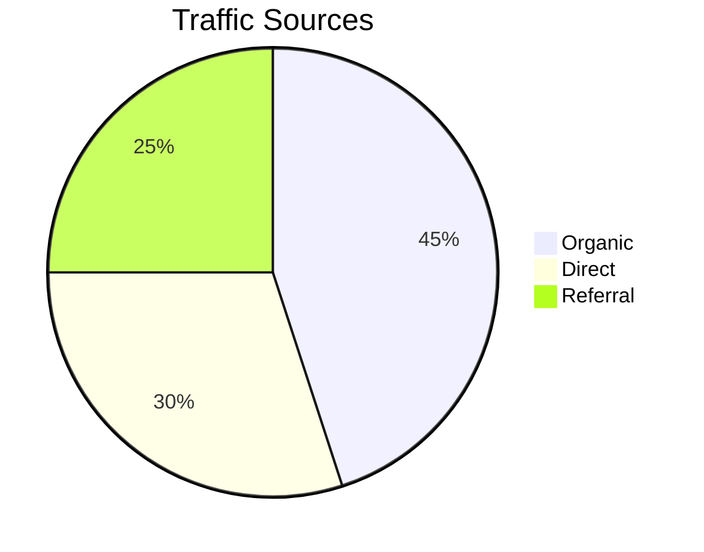
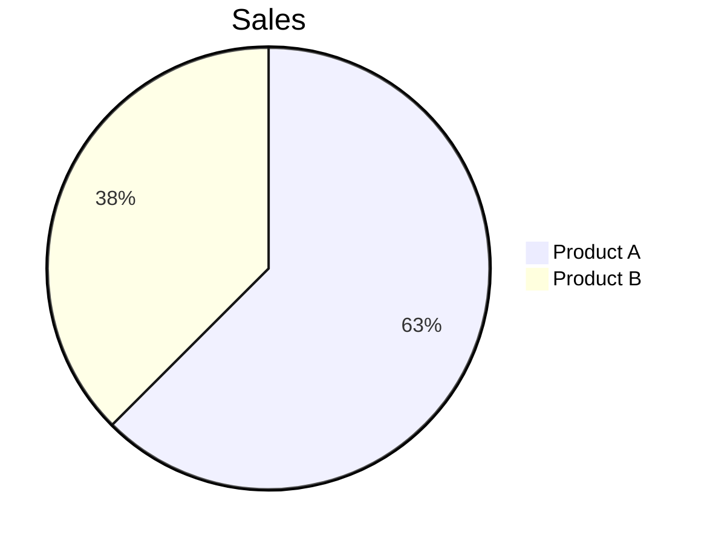
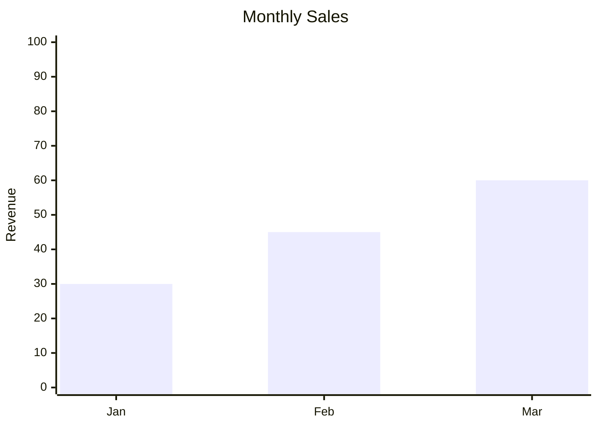
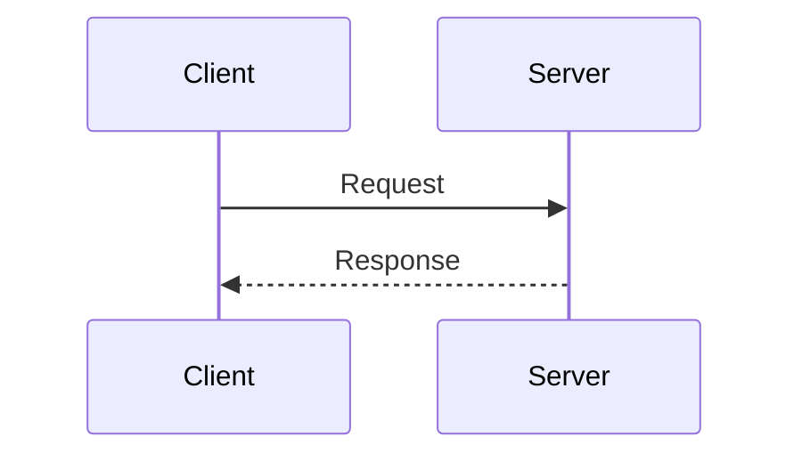

# Presenting the Written Work

The document and the work are not the same thing. A document is the form the work arrives in, and putting it in front of the reader well — the typeface, the spacing, the way structure reads at a glance — is part of finishing the job, not decoration on top of it. Work that is done but left unreadable is work that stops one step short.

What this skill provides: a background HTTP server that turns markdown into a calm, book-like page you read in the browser.

**Note:** The HTML generation path (`/tkm:preview-output --html ...`) is a different thing. It writes self-contained HTML files you open straight from disk, and it never touches this server.

## ⚠️ Installation Required

**This skill leans on npm packages — install them before first use.** Pick one route:

```bash
# Option 1: Install via Takumi Agent Kit CLI (recommended)
ck init  # Runs install.sh which handles all skills

# Option 2: Manual installation
cd .claude/skills/markdown-novel-viewer
npm install
```

**Dependencies:** `marked`, `highlight.js`, `gray-matter`

Skip the install and the renderer falls over with **Error 500: Error rendering markdown**.

## Purpose

One viewer, any path — hand it something and it figures out what to show:
- **Markdown files** → novel-reader UI with serif fonts, warm theme
- **Directories** → file listing browser with clickable links

## Quick Start

```bash
# View a markdown file
node .claude/skills/markdown-novel-viewer/scripts/server.cjs \
  --file ./plans/my-plan/plan.md \
  --open

# Browse a directory
node .claude/skills/markdown-novel-viewer/scripts/server.cjs \
  --dir ./plans \
  --host 0.0.0.0 \
  --open

# Background mode
node .claude/skills/markdown-novel-viewer/scripts/server.cjs \
  --file ./README.md \
  --background

# Stop all running servers
node .claude/skills/markdown-novel-viewer/scripts/server.cjs --stop
```

## Skill Invocation

The short way in is `/tkm:preview-output`:

```bash
/tkm:preview-output plans/my-plan/plan.md    # View markdown file
/tkm:preview-output plans/                   # Browse directory
/tkm:preview-output --stop                   # Stop server
```

## Features

### Novel Theme
- Warm cream background (light mode)
- Dark mode with warm gold accents
- Libre Baskerville serif headings
- Inter body text, JetBrains Mono code
- Maximum 720px content width

### Mermaid.js Diagrams
- Any `mermaid` code block is drawn out as a diagram
- Follows the active theme (light/dark mode support)
- Click a diagram to swing it full-width, click again to collapse
- When a diagram fails, it shows the error next to the offending source

### Directory Browser
- Clean file listing with emoji icons
- Markdown files link to viewer
- Folders link to sub-directories
- Parent directory navigation (..)
- Light/dark mode support

### Focused Reader Mode
- **Auto-hide header**: Scroll down and the header tucks away; scroll back up and it returns
- **Progress bar**: A thin horizontal bar stays on screen, marking how far through you are
- **Distraction-free**: The chrome stays minimal and steps aside while you read
- **Smooth transitions**: The header eases in and out rather than snapping

### Plan Navigation
- Recognizes a plan directory layout on its own
- Accordion sidebar, each entry tagged with its status (✓ complete, ⏳ in progress)
- Buttons to step to the previous or next file
- The scroll-driven auto-hide header and progress bar carry over here too
- On phones, a floating action button (FAB) handles navigation
- A slide-up bottom sheet stands in for the sidebar on small screens

### Keyboard Shortcuts

**First-time toast**: On a first visit a "Press ? for keyboard shortcuts" hint appears, then clears itself after 5s

**Available shortcuts:**
- `?` - Show keyboard shortcuts cheatsheet (full-screen overlay)
- `T` - Toggle theme (light/dark)
- `S` - Toggle sidebar (desktop)
- `←` / `→` - Navigate previous/next phase
- `Esc` - Close sidebar (mobile) or cheatsheet modal

**Cheatsheet modal**: `?` brings up every shortcut in a full-screen overlay over a blurred backdrop. Dismiss it with `Esc`, the `×` button, or a click on the backdrop.

### Mobile Optimization
- **FAB (Floating Action Button)**: A button pinned bottom-right drives navigation on phones
- **Bottom sheet**: The sidebar slides up from the bottom and responds to touch gestures
- **Touch-friendly**: Bigger tap targets and swipe gestures
- **Responsive breakpoint**: The layout flips at a 768px viewport width

## CLI Options

| Option | Description | Default |
|--------|-------------|---------|
| `--file <path>` | Markdown file to view | - |
| `--dir <path>` | Directory to browse | - |
| `--port <number>` | Server port | 3456 |
| `--host <addr>` | Host to bind (`0.0.0.0` for remote) | localhost |
| `--open` | Auto-open browser | false |
| `--background` | Run in background | false |
| `--stop` | Stop all servers | - |

## Architecture

```
scripts/
├── server.cjs               # Main entry point
└── lib/
    ├── port-finder.cjs      # Dynamic port allocation
    ├── process-mgr.cjs      # PID file management
    ├── http-server.cjs      # Core HTTP routing (/view, /browse)
    ├── markdown-renderer.cjs # MD→HTML conversion
    └── plan-navigator.cjs   # Plan detection & nav

assets/
├── template.html            # Markdown viewer template
├── reader.js                # Client-side interactivity
├── novel-theme.css          # Main theme file (imports modules)
├── directory-browser.css    # Directory browser styles
└── styles/                  # Modular CSS architecture
    ├── novel-theme-base.css       # Base colors, fonts, reset
    ├── novel-theme-typography.css # Headings, paragraphs, lists
    ├── novel-theme-code.css       # Code blocks, syntax highlighting
    ├── novel-theme-tables.css     # Table styling
    ├── novel-theme-links.css      # Link states, hover effects
    ├── novel-theme-layout.css     # Grid, spacing, containers
    ├── novel-theme-header.css     # Auto-hide header, progress bar
    ├── novel-theme-sidebar.css    # Accordion sidebar, status badges
    └── novel-theme-overlays.css   # Toast, cheatsheet modal
```

## HTTP Routes

| Route | Description |
|-------|-------------|
| `/view?file=<path>` | Markdown file viewer |
| `/browse?dir=<path>` | Directory browser |
| `/assets/*` | Static assets |
| `/file/*` | Local file serving (images) |

## Dependencies

- Node.js built-in: `http`, `fs`, `path`, `net`
- npm: `marked`, `highlight.js`, `gray-matter` (installed via `npm install`)

## Customization

### Theme Colors (CSS Variables)

The light palette lives in `assets/novel-theme.css`:
```css
--bg-primary: #faf8f3;      /* Warm cream */
--accent: #8b4513;          /* Saddle brown */
```

And the dark palette beside it:
```css
--bg-primary: #1a1a1a;      /* Near black */
--accent: #d4a574;          /* Warm gold */
```

### Content Width
```css
--content-width: 720px;
```

## Remote Access

Reading from a second device on the same network takes one change — bind to every interface instead of just localhost:

```bash
# Start with 0.0.0.0 to bind to all interfaces
node .claude/skills/markdown-novel-viewer/scripts/server.cjs --file ./README.md --host 0.0.0.0 --port 3456
```

Pass `--host 0.0.0.0` and the server works out its address on the LAN and prints it alongside the local one:

```json
{
  "success": true,
  "url": "http://localhost:3456/view?file=...",
  "networkUrl": "http://192.168.2.75:3456/view?file=...",
  "port": 3456
}
```

The `networkUrl` is the one to hand to other machines on the network.

## Troubleshooting

**Port in use**: Server auto-increments to next available port (3456-3500)

**Images not loading**: Image paths have to be relative to the markdown file

**Server won't stop**: Look in `/tmp/md-novel-viewer-*.pid` for stale PID files

**Remote access denied**: Bind every interface with `--host 0.0.0.0`

## Mermaid.js Diagrams

### Usage

Fence the diagram with `mermaid` as the language:

````markdown

````

### Supported Diagram Types

| Type | Syntax | Use Case |
|------|--------|----------|
| Flowchart | `flowchart LR/TB/TD` | Process flows, decision trees |
| Sequence | `sequenceDiagram` | API interactions, message flows |
| Pie | `pie title "..."` | Distribution data |
| Gantt | `gantt` | Project timelines |
| XY Chart | `xychart-beta` | Bar/line charts |
| Mindmap | `mindmap` | Idea hierarchies |
| Quadrant | `quadrantChart` | 2x2 matrices |

### Validating Mermaid Snippets

**Quick validation**: The [Mermaid Live Editor](https://mermaid.live) is the fastest place to test syntax before committing it.

**Common errors and fixes**:

| Error | Cause | Fix |
|-------|-------|-----|
| `Parse error` | Invalid syntax | Check diagram type declaration |
| `Unknown diagram type` | Typo in declaration | Use exact type: `flowchart`, not `flow` |
| `Expecting token` | Missing quotes/brackets | Ensure balanced delimiters |
| `UnknownDiagramError` | Empty or malformed block | Add valid diagram content |

### Fixing Common Issues

**1. Flowchart arrows**


**2. Pie chart values**


**3. XY Chart data format**


**4. Sequence diagram participants**


### Debug Mode

When a diagram won't parse, the viewer hands back what you need to fix it:
- Error message
- Expandable source code preview
- Line number where parsing failed (when available)

Correct the syntax, refresh, and it re-renders.
