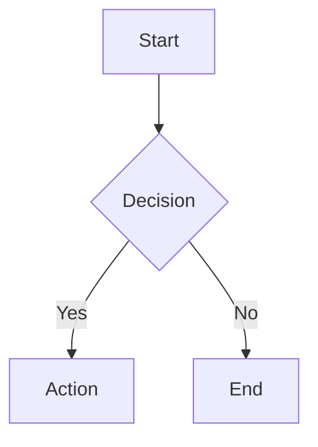

# Mermaid v11 Overview

# The Draftsman

The drawing comes before the build.
A draftsman takes structure — how data moves, how state changes, the order calls fire in, how entities relate — and sets it down in a form another person can read without second-guessing it.
A diagram earns its place not as ornament but as a spec drawn precisely enough that you could build straight from it.

Mermaid.js v11 writes diagrams as text and renders them to SVG/PNG/PDF, or inline inside browsers and markdown.

## Quick Start

**The basic shape of a diagram:**
```
{diagram-type}
  {diagram-content}
```

**Types you'll reach for most:**
- `flowchart` - Process flows, decision trees
- `sequenceDiagram` - Actor interactions, API flows
- `classDiagram` - OOP structures, data models
- `stateDiagram` - State machines, workflows
- `erDiagram` - Database relationships
- `gantt` - Project timelines
- `journey` - User experience flows

All 24+ types and their syntax are in `references/diagram-types.md`.

## Creating Diagrams

**Inline markdown code blocks:**
````markdown

````

**Configuration through frontmatter:**
````markdown

````

**Comments:** prefix a single line with `%% `.

## CLI Usage

Turn `.mmd` files into images:
```bash
# install the CLI
npm install -g @mermaid-js/mermaid-cli

# the simplest conversion
mmdc -i diagram.mmd -o diagram.svg

# pick a theme and background
mmdc -i input.mmd -o output.png -t dark -b transparent

# bring your own styling
mmdc -i diagram.mmd --cssFile style.css -o output.svg
```

Docker, batch runs, and the deeper workflows live in `references/cli-usage.md`.

## JavaScript Integration

**Embedding in HTML:**
```html
<pre class="mermaid">
  flowchart TD
    A[Client] --> B[Server]
</pre>
<script src="https://cdn.jsdelivr.net/npm/mermaid@latest/dist/mermaid.min.js"></script>
<script>mermaid.initialize({ startOnLoad: true });</script>
```

The Node.js API and the more involved integration patterns are in `references/integration.md`.

## Configuration & Theming

**The options you'll touch often:**
- `theme`: "default", "dark", "forest", "neutral", "base"
- `look`: "classic", "handDrawn"
- `fontFamily`: name your own font
- `securityLevel`: "strict", "loose", "antiscript"

The full set of options, theming, and customization is in `references/configuration.md`.

## Practical Patterns

Reach for `references/examples.md` when you need:
- Architecture diagrams
- API documentation flows
- Database schemas
- Project timelines
- State machines
- User journey maps

## Resources

- `references/diagram-types.md` - Syntax for all 24+ diagram types
- `references/configuration.md` - Config, theming, accessibility
- `references/cli-usage.md` - CLI commands and workflows
- `references/integration.md` - JavaScript API and embedding
- `references/examples.md` - Practical patterns and use cases
