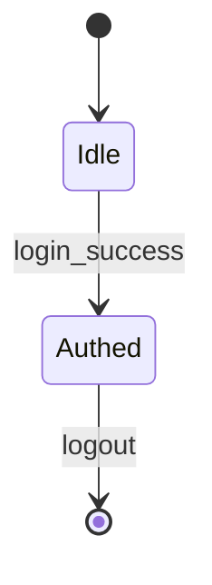

# F001_Auth — Authentication

**Priority**: P0
**Type**: ui
**Generated**: 2026-05-18

## Overview

Authentication allows registered users to sign in.

## Why This Exists

Users must prove identity.

## Who Uses It

- **Registered User** — signs in

## Business Workflow

1. User submits credentials.
2. Validate.
3. Issue token.

## Screen Flow

**See:** ScreenFlow § F001_Auth

## Polymorphic Behavior

N/A — no discriminator fields in Key Entities.

## Cross-Cutting Logic

### Requirements

None.

### Business Rules

None.

### Decision Logic

None.

### State Machines

See SM-001 below.

### SM-001_LoginFlow
**Linked FR:** FR-001
**Source:** `claude/skills/rebuild-spec/scripts/tests/fixtures/cited-source.py:1-5`

The login state machine governs session transitions across the authentication
lifecycle. It models every observable state a user session can be in, from
unauthenticated guest through authentication challenges, multi-factor enrollment,
session active, and clean termination. Each transition is triggered by a single
domain event and carries side-effects documented inline.

Line 5 of intro prose to push the mermaid fence past the 50-line legacy window.
Line 6 of intro prose to push the mermaid fence past the 50-line legacy window.
Line 7 of intro prose to push the mermaid fence past the 50-line legacy window.
Line 8 of intro prose to push the mermaid fence past the 50-line legacy window.
Line 9 of intro prose to push the mermaid fence past the 50-line legacy window.
Line 10 of intro prose to push the mermaid fence past the 50-line legacy window.
Line 11 of intro prose to push the mermaid fence past the 50-line legacy window.
Line 12 of intro prose to push the mermaid fence past the 50-line legacy window.
Line 13 of intro prose to push the mermaid fence past the 50-line legacy window.
Line 14 of intro prose to push the mermaid fence past the 50-line legacy window.
Line 15 of intro prose to push the mermaid fence past the 50-line legacy window.
Line 16 of intro prose to push the mermaid fence past the 50-line legacy window.
Line 17 of intro prose to push the mermaid fence past the 50-line legacy window.
Line 18 of intro prose to push the mermaid fence past the 50-line legacy window.
Line 19 of intro prose to push the mermaid fence past the 50-line legacy window.
Line 20 of intro prose to push the mermaid fence past the 50-line legacy window.
Line 21 of intro prose to push the mermaid fence past the 50-line legacy window.
Line 22 of intro prose to push the mermaid fence past the 50-line legacy window.
Line 23 of intro prose to push the mermaid fence past the 50-line legacy window.
Line 24 of intro prose to push the mermaid fence past the 50-line legacy window.
Line 25 of intro prose to push the mermaid fence past the 50-line legacy window.
Line 26 of intro prose to push the mermaid fence past the 50-line legacy window.
Line 27 of intro prose to push the mermaid fence past the 50-line legacy window.
Line 28 of intro prose to push the mermaid fence past the 50-line legacy window.
Line 29 of intro prose to push the mermaid fence past the 50-line legacy window.
Line 30 of intro prose to push the mermaid fence past the 50-line legacy window.
Line 31 of intro prose to push the mermaid fence past the 50-line legacy window.
Line 32 of intro prose to push the mermaid fence past the 50-line legacy window.
Line 33 of intro prose to push the mermaid fence past the 50-line legacy window.
Line 34 of intro prose to push the mermaid fence past the 50-line legacy window.
Line 35 of intro prose to push the mermaid fence past the 50-line legacy window.
Line 36 of intro prose to push the mermaid fence past the 50-line legacy window.
Line 37 of intro prose to push the mermaid fence past the 50-line legacy window.
Line 38 of intro prose to push the mermaid fence past the 50-line legacy window.
Line 39 of intro prose to push the mermaid fence past the 50-line legacy window.
Line 40 of intro prose to push the mermaid fence past the 50-line legacy window.
Line 41 of intro prose to push the mermaid fence past the 50-line legacy window.
Line 42 of intro prose to push the mermaid fence past the 50-line legacy window.
Line 43 of intro prose to push the mermaid fence past the 50-line legacy window.
Line 44 of intro prose to push the mermaid fence past the 50-line legacy window.
Line 45 of intro prose to push the mermaid fence past the 50-line legacy window.
Line 46 of intro prose to push the mermaid fence past the 50-line legacy window.
Line 47 of intro prose to push the mermaid fence past the 50-line legacy window.
Line 48 of intro prose to push the mermaid fence past the 50-line legacy window.
Line 49 of intro prose to push the mermaid fence past the 50-line legacy window.
Line 50 of intro prose to push the mermaid fence past the 50-line legacy window.
Line 51 of intro prose to push the mermaid fence past the 50-line legacy window.
Line 52 of intro prose to push the mermaid fence past the 50-line legacy window.

### Algorithms

None.

### External Integrations

None.

### Verification

None.

---

**Client behavior:** see
[`behavior-logic.md`](../../behavior-logic.md) (client-side patterns — debounce, optimistic UI, polling, upload, realtime),
[`permissions.md`](../../permissions.md) (feature flags / experiments / env / locale gates),
[`screen-flow.md`](../../screen-flow.md) (guards / deep-link state restoration / unsaved-changes protection).

## User Stories

### US001_Login — User logs in (Priority: P0)

**What happens:** Valid credentials return token.
**Why this priority:** Core entry point.
**Independent Test:** POST /login returns 200.

### Edge Cases

| Scenario | Behavior |
|----------|----------|
| Empty password | HTTP 422 |

## Key Entities

| Entity | Table | Purpose |
|--------|-------|---------|
| User | users | Credential lookup |

## Artifact References

| Artifact | File | Codes Used | Reviewed |
|----------|------|------------|----------|
| System Overview | [system-overview.md](../../system-overview.md) | — | [x] |
| Feature List | [feature-list.md](../../feature-list.md) | F001_Auth | [x] |
| Route List | [route-list.md](../../route-list.md) | — | [ ] |
| Data Model | [data-model.md](../../data-model.md) | — | [ ] |
| Screen List | [screen-list.md](../../screen-list.md) | SCR001_LoginForm | [ ] |
| Screen Flow | [screen-flow.md](../../screen-flow.md) | — | [ ] |
| Behavior Logic | [behavior-logic.md](../../behavior-logic.md) | — | [ ] |
| Permissions | [permissions.md](../../permissions.md) | — | [ ] |
| User Stories | [user-stories.md](../../user-stories.md) | — | [ ] |

**Rule:** Every code listed MUST exist in its source artifact. Orphan refs = reviewer critical.

## Assumptions

- bcrypt hashing.

## Source Code References

**Source:** `claude/skills/rebuild-spec/scripts/tests/fixtures/cited-source.py:1-5`

## Unresolved Questions

None.
