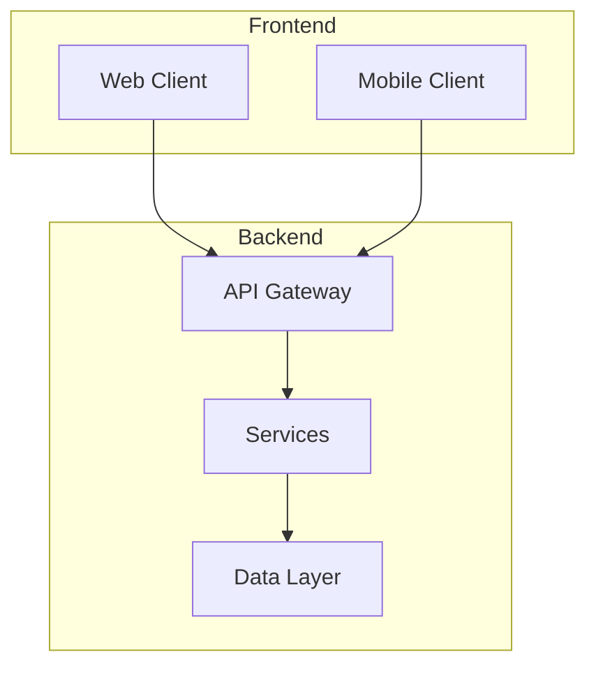
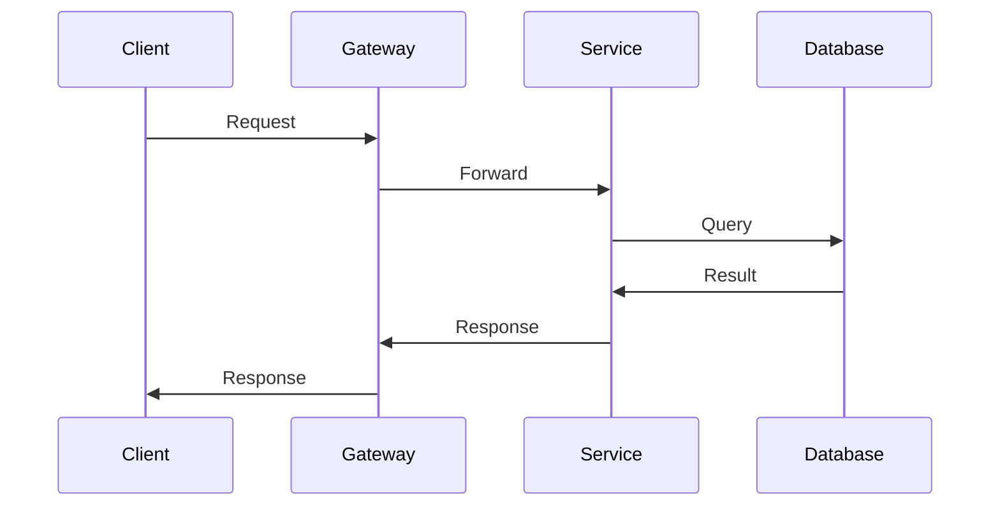

# Architecture

## System Architecture

## Tech Stack

| Layer | Technology | Version |
|-------|------------|---------|
| Frontend | {FRONTEND_TECH} | {VERSION} |
| Backend | {BACKEND_TECH} | {VERSION} |
| Database | {DB_TYPE} | {VERSION} |
| Cache | {CACHE_TYPE} | {VERSION} |
| Queue | {QUEUE_TYPE} | {VERSION} |

## Data Flow

