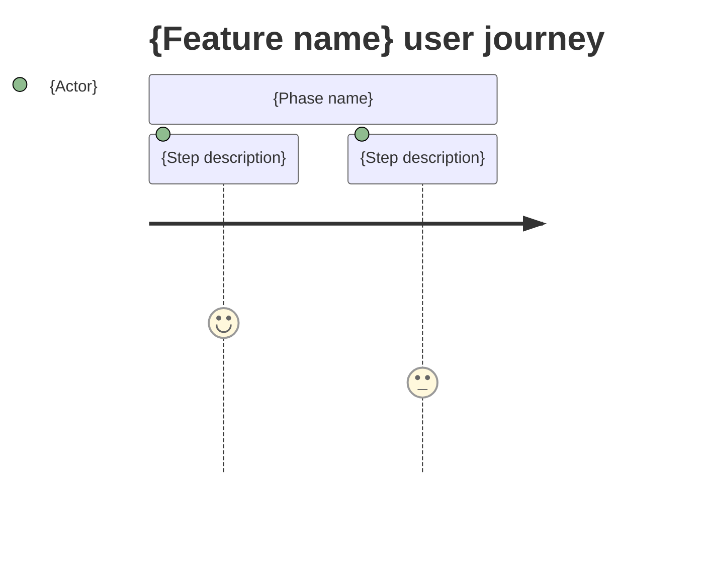

<!-- LARGE OUTPUT NOTE: if this file exceeds 400 lines, signal to orchestrator for chunked review -->

# Screens — {F###_NAME}

## Screen List

{For background-only features with no UI, replace this section with:
`N/A — background feature; no user-facing screens.` — omit the table entirely (no SCR### rows).}

<!-- SCR### = the canonical screen code (SCR###_NameSlug) from generated/screen-list.md.
     It is the bridge to the full per-screen spec at docs/screens/SCR###_Name/spec.md, and
     the inverse of the **Feature** backlink in that spec's header. Each code MUST resolve
     to a row in screen-list.md (validate_feature_screen_link.py enforces this). -->

| Screen Name | SCR### | What User Sees | What User Can Do |
|-------------|--------|----------------|------------------|
| {ScreenName} | {SCR###_NameSlug from screen-list.md} | {plain description of page content} | {actions available to the user} |
| {ScreenName} | {SCR###_NameSlug from screen-list.md} | {plain description of page content} | {actions available to the user} |

## User Journey

{Numbered steps in plain language. Reference screen names from the table above.
Do NOT reference routes, endpoints, or component names.}

1. User arrives at {Screen Name} and sees {content description}.
2. User {action} — {what changes or what they see next}.
3. User is taken to {Screen Name} where {outcome}.

{Optional Mermaid journey diagram:}

