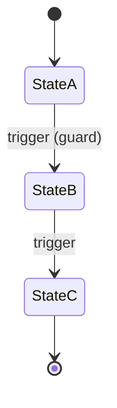
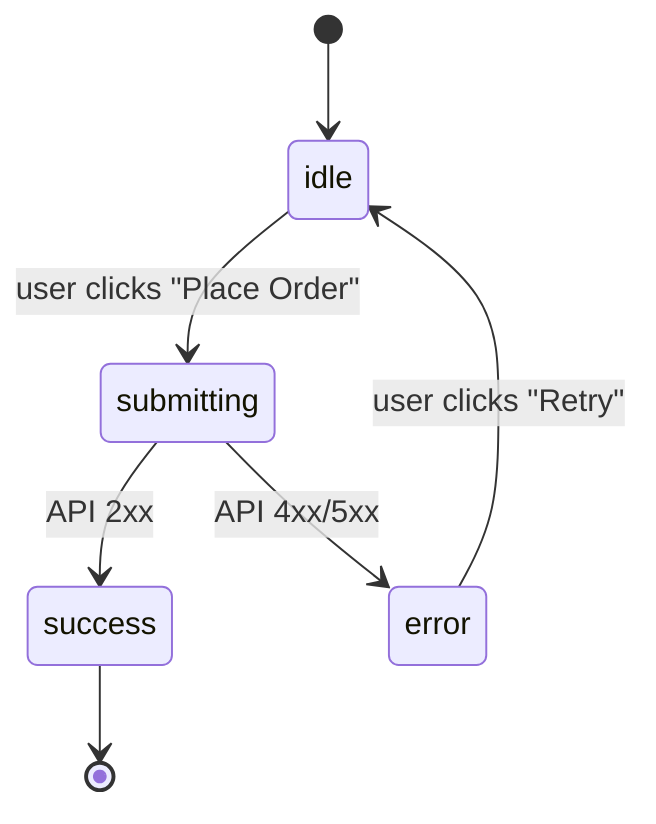

<!-- layout-exempt: rebuild-spec owns all docs/system|features|generated|flows paths — all references here are output targets or internal definitions -->
<!-- Contract: references/feature-spec-researcher-contract.md -->
<!-- LARGE OUTPUT NOTE: if this file exceeds 400 lines, signal to orchestrator for chunked review -->

# Technical Spec — {F###_NAME}

**Priority**: {P0|P1|P2|P3}
**Type**: {ui|background|mixed}
**Generated**: {DATE}

## Overview

{2–3 sentence narrative: what the feature does, who uses it, what triggers it, which subsystems it touches.}

## Polymorphic Behavior

{For each DISC-### whose entity appears in ## Key Entities, document per-value behavior.
Cross-reference docs/generated/entities.md for the authoritative values list.}

{If Key Entities include DISC-### fields — add one table per discriminator:}

### DISC-### — {EntityName}.{field_name}

| Value | Render | Validation | Persistence |
|-------|--------|------------|-------------|
| {val1} | {what the UI shows/hides, which components render} | {which rules apply, what is blocked} | {what DB writes/state changes occur} |
| {val2} | {render behavior} | {validation behavior} | {persistence behavior} |

**Source:** docs/generated/entities.md § {EntityName} > Discriminator Fields

{If Key Entities have NO DISC-### fields, write exactly:}
N/A — no discriminator fields in Key Entities.

## Polymorphic Behavior

{For each DISC-### whose entity appears in ## Key Entities, document per-value behavior.
Cross-reference data-model.md for the authoritative values list.}

{If Key Entities include DISC-### fields — add one table per discriminator:}

### DISC-### — {EntityName}.{field_name}

| Value | Render | Validation | Persistence |
|-------|--------|------------|-------------|
| {val1} | {what the UI shows/hides, which components render} | {which rules apply, what is blocked} | {what DB writes/state changes occur} |
| {val2} | {render behavior} | {validation behavior} | {persistence behavior} |

{Source: data-model.md § {EntityName} > Discriminator Fields}

{If Key Entities have NO DISC-### fields, write exactly:}
N/A — no discriminator fields in Key Entities.

## Cross-Cutting Logic

{Use for FR/BR/SM/ALG/INT/SC that apply to ≥2 USs equally OR are system-wide invariants.
When in doubt, place inline under the primary US instead.}

### Requirements

| Code | Description | Endpoint/Handler | Verifiable |
|------|-------------|------------------|------------|
| FR-0XX | {DESCRIPTION — cross-cutting FRs only} | {METHOD} {PATH} | yes |

**Source:** `{path/to/controller.ext:line-line}`

### Business Rules

None.

### Decision Logic

User-facing decisions with **business outcome user-visible to the end user**. Scope is by OUTCOME, not by source code location — saga / observer / controller / component code are all valid Sources as long as the decision changes what the user sees, interacts with, or where they go.

**Subtypes** (list — declare ≥1, may declare multiple):
- `render` — multi-predicate render branches (single-field → DISC)
- `interaction` — event handlers altering visible UI state with business meaning
- `flow` — multi-step wizard / in-feature routing / post-action navigation

**Out of scope** (do NOT create DEC):
- Loading spinner toggles (`isLoading ? <Spinner/> : <Content/>`)
- Generic API dispatch (`if success → dispatch SUCCESS`)
- Cosmetic style toggles
- Single-field conditions (those are DISC)

---

#### DEC-001_{RenderBranchSlug}
**subtype:** render
**Triggers in:** SCR00X_{ScreenSlug} mount
**Involved entities:** {Entity}.{role_or_type_field}, {Entity}.{status_field}
**user_visible_outcome:** which UI panels/buttons appear based on role and state
**Source:** `{path/to/component.ext:line-line}`

```pseudo
if entity.role === 'admin' AND entity.status === 'active' → render PanelA + ActionButton
else if entity.role === 'admin' → render PanelA only
else if entity.role === 'editor' → render ActionButton only
else → render neither
```

---

(If feature has no DEC-### entries: `N/A — no user-facing decision logic beyond DISC-### Polymorphic Behavior.`)

### State Machines

None.

### Algorithms

None.

### External Integrations

None.

### Verification

- **SC-0XX** — {global pass/fail condition} (covers FR-0XX)

---

**Client behavior:** see
[`behavior-logic.md`](../../docs/system/behavior-logic.md) (client-side patterns — debounce, optimistic UI, polling, upload, realtime),
[`permissions.md`](../../docs/system/permissions.md) (feature flags / experiments / env / locale gates),
[`architecture.md`](../../docs/system/architecture.md) (guards / deep-link state restoration / unsaved-changes protection).

## User Stories

### {US001_CODE} — {US001_TITLE} (Priority: P1)

**What happens:** {Narrative — who does what, under what conditions, to achieve what outcome.}
**Why this priority:** {Value + urgency rationale. Why P1 and not P2?}
**Independent Test:** {How this story can be validated alone — specific action + observable result.}

**Acceptance Scenarios:**

1. **Given** {initial state}, **When** {action}, **Then** {expected outcome}.
2. **Given** {initial state}, **When** {action}, **Then** {expected outcome}.

**Requirements fulfilled:**
- **FR-001** {DESCRIPTION} — `{METHOD} {PATH}` via `{Handler::method}`
  **Source:** `{path/to/handler.ext:line-line}`
- **FR-002** {DESCRIPTION} — `{METHOD} {PATH}` via `{Handler::method}`
  **Source:** `{path/to/handler.ext:line-line}`

**Rules enforced:**

### BR-001_{NameSlug}
**Linked FR:** FR-???
**Source:** `{file}:{start}-{end}`
**Applies to:** {endpoint / event / entity}
**Rule:** {What must hold, when enforced, why it exists.}

**Pseudocode:**
```text
# ≤20 lines capturing the check intent
```

**State transitions:**

**`kind` values:**
- `entity` — tracks domain object lifecycle (e.g., Order status: draft → placed → shipped → delivered). State is persisted (DB column, ORM attribute).
- `ui` — tracks view-layer async state (e.g., form: idle → submitting → success/error). State is component-local (useState, ref, computed, signal — not persisted).
- When both apply (entity status mirrored by UI loading state), document as 2 separate SM-### blocks.
- **Threshold:** only use `kind: ui` for state machines with ≥3 states OR ≥2 transitions. Smaller cases stay implicit in BR-### rules.

### SM-001_{EntityLifecycleSlug}
**kind:** entity
**Linked FR:** FR-???
**Source:** `{file}:{start}-{end}`
**States:** {State1, State2, State3}



**Transition rules:**
- `StateA → StateB`: guard = {condition}; side effects = {effect}
- `StateB → StateC`: guard = {condition}; side effects = {effect}

### SM-002_CheckoutFormStatus
**kind:** ui
**Linked FR:** FR-???



| From | To | Guard | Side effect |
|------|----|-------|-------------|
| idle | submitting | form valid | show spinner |
| submitting | success | 2xx response | redirect to confirmation |
| submitting | error | 4xx/5xx | show inline error |
| error | idle | — | clear error message |

**Algorithms:**

### ALG-001_{AlgorithmNameSlug}
**Linked FR:** FR-???
**Source:** `{file}:{start}-{end}`
**Input:** {shape summary}
**Output:** {shape summary}
**File Schema**: {`| Column | Type | Required | Notes |` table (or sheet-name + column-list per sheet for multi-sheet XLSX) — sourced from `validateHeader()`/schema-array/column-mapping | `N/A — not a file-exchange type`} (populated only when the algorithm imports/exports a file — vocab match on `import, export, csv, xlsx, upload, download, bulk`)
**Complexity:** {O(n) — or `N/A` if trivial}
**Description:** {What it computes, why, invariants it preserves.}

**Pseudocode:**
```text
# ≤20 lines
```

**External integrations:**

### INT-001_{IntegrationNameSlug}
**Linked FR:** FR-???
**Source:** `{file}:{start}-{end}`
**Type:** {api-call | event-publish | webhook-emit | queue-job | notification}
**Target:** {service / topic / queue / endpoint}
**Trigger:** {when invoked}
**Payload:** {fields sent, excluding secrets}
**Failure handling:** {retry policy / DLQ / ignore / compensating action}

**Pseudocode:**
```text
# ≤20 lines
```

**Verification:**
- **SC-001** {pass/fail observable condition} (covers FR-001, BR-001)
- **SC-002** {pass/fail observable condition} (covers FR-002, SM-001)

---

### {US002_CODE} — {US002_TITLE} (Priority: P2)

**What happens:** {Narrative.}
**Why this priority:** {Rationale.}
**Independent Test:** {Validation approach.}

**Acceptance Scenarios:**

1. **Given** {state}, **When** {action}, **Then** {outcome}.

**Requirements fulfilled:**
- **FR-003** {DESCRIPTION} — `{METHOD} {PATH}` via `{Handler::method}`
  **Source:** `{path/to/handler.ext:line-line}`

**Rules enforced:** BR-001 (see US001) — {additional note on how it applies here, if any}

**State transitions:** SM-001 (see US001) — additional transition {StateX → StateY on specific trigger}

**Verification:**
- **SC-003** {pass/fail observable condition} (covers FR-003, SM-001)

---

### Edge Cases

{MANDATORY — minimum 3 rows for UI features, 1 for background features.
Each row must specify scenario, system behavior, and HTTP status/error message.}

| Scenario | Behavior |
|----------|----------|
| {boundary condition / invalid input} | HTTP {4xx}: "{error message from controller}" |
| {concurrent operation / race condition} | {specific system behavior — queue, lock, reject} |
| {missing prerequisite / empty state} | {fallback behavior or error response} |

## Key Entities

{MANDATORY — list ALL database tables this feature reads or writes.
Include table name (not just model code), key columns, and purpose.
Minimum 3 entities for non-trivial features.}

| Entity | Table | Key Columns | Purpose |
|--------|-------|-------------|---------|
| {ModelName} | `{table_name}` | {col1, col2, col3} | {what this feature does with it} |
| {ModelName2} | `{table_name_2}` | {col1, col2} | {read/write purpose} |

## Artifact References

| Artifact | File | Codes Used | Reviewed |
|----------|------|------------|----------|
| System Overview | [system-overview.md](../../docs/system/system-overview.md) | — | [x] |
| Architecture | [architecture.md](../../docs/system/architecture.md) | — | [x] |
| Feature List | [feature-list.md](../../docs/generated/feature-list.md) | {F###} | [x] |
| API Map | [api-map.md](../../docs/generated/api-map.md) | {ROUTE###} | [ ] |
| Entities | [entities.md](../../docs/generated/entities.md) | {MODEL###} | [ ] |
| Screens | [screens.md](../../docs/features/{F###}/screens.md) | {SCR###, SCR###/REG###} | [ ] |
| Behavior Logic | [behavior-logic.md](../../docs/system/behavior-logic.md) | {BL###} | [ ] |
| Permissions Matrix | [permissions-matrix.md](../../docs/generated/permissions-matrix.md) | {PERM###} | [ ] |
| User Stories | [user-stories.md](../../docs/generated/user-stories.md) | {US###} | [ ] |

**Rule:** Every code listed in Codes Used MUST exist in its source artifact. Orphan refs = reviewer critical. For region ownership, use `SCR###/REG###` format in Codes Used (e.g. `SCR001/REG001`). `{ROUTE###}` on the API Map row resolves to `route-list.md`'s `Code` column (not `api-map.md`, which has no code scheme) — `validate_feature_api_link.py` enforces this plus the reverse `Owner F###` twin-consistency check.

## Assumptions

{MANDATORY — minimum 2 entries for non-trivial features.
Document implicit behaviors, missing DB constraints, eval assumptions, etc.}

- {ASSUMPTION_1 — e.g., "short_name uniqueness enforced at app level, not DB constraint"}
- {ASSUMPTION_2 — e.g., "default value assumed true on create unless set otherwise"}

## Source Code References

{MANDATORY — minimum 3 entries. List primary controllers, models, jobs, services, Vue/page files.
Only include files verified via Grep/Read. DO NOT fabricate paths.}

| Symbol | Path | Purpose |
|--------|------|---------|
| {ControllerName} | `{api/app/Http/Controllers/...}:{line-range}` | {CRUD + guards} |
| {ModelName} | `{api/app/Models/...}:{line-range}` | {entity definition + relations} |
| {JobName} | `{api/app/Jobs/...}` | {background processing} |
| {PageComponent} | `{web/src/pages/...}` | {frontend view} |

## Unresolved Questions

{MANDATORY for complex features (≥1 entry). List anything you could NOT verify from source code,
ambiguous behaviors, undocumented edge cases, or unclear relationships.}

1. **{Topic}**: {Specific question about implementation detail not confirmed from source}
2. **{Topic}**: {Another unresolved question}
